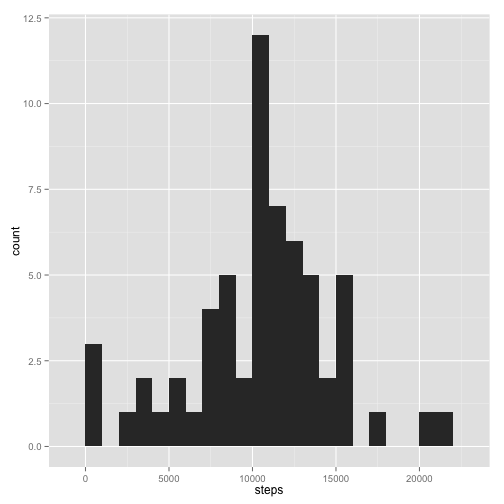

Reproducible Research Assignment 1
===================================
                                                                           
                                                                                 
##load data

```r
# setwd("~/Desktop/Reproducible Research/03-Assessment/Peer Assessment 1")
data <- read.csv("activity.csv") # 17568 obs
```
      
##What is mean total number of steps taken per day?  
 - First, calculate total number of steps taken by each days  

```r
totalSteps <- aggregate(steps ~ date, data, sum)
```
      
 - Then, make a histogram of the total number of steps taken by each day  

```r
# install.packages("ggplot2")
library(ggplot2)
ggplot(totalSteps, aes(x=steps)) + geom_histogram(binwidth = 1000)
```

 
      
 - Finally, calculate and report the mean and median total number of steps taken per day  

```r
me <- mean(totalSteps$steps)
md <- median(totalSteps$steps)
sprintf("The mean and median total number of steps taken per day are %.1f and %.1f, respectively", me, md)
```

```
## [1] "The mean and median total number of steps taken per day are 10766.2 and 10765.0, respectively"
```
The mean total number of steps taken per day is 1.0766 &times; 10<sup>4</sup>. And the median total number of steps taken per day is 10765.  
      
#What is the average daily activity pattern?
 - First, calculate the average daily activity per interval, averaged across all days

```r
meanIntvSteps <- aggregate(steps ~ interval, data, mean)
```
           
 - Then, make a time series plot (i.e. type = "l") of the 5-minute interval (x-axis) and the average number of steps taken, averaged across all days (y-axis).

```r
ggplot(meanIntvSteps, aes(x=interval, y=steps)) + geom_line()
```

 
      
 - Finally, find out which 5-minute interval, on average across all the days in the dataset, contains the maximum number of steps.

```r
maxSteps <- max(meanIntvSteps$steps)
maxIntv <- meanIntvSteps[which(meanIntvSteps$steps == maxSteps),]
sprintf("The interval %d contains the maximum average number of steps (%.4f) across all the days in the dataset", maxIntv[, 1], maxSteps)
```

```
## [1] "The interval 835 contains the maximum average number of steps (206.1698) across all the days in the dataset"
```
The interval 835 contains the maximum average number of steps (206.1698), averaged across all the days in the dataset.
      
      
#Imputing missing values
   
1. Calculate and report the total number of missing values in the dataset (i.e. the total number of rows with NAs)


```r
# totalRow <- nrow(data)
naRow <- sum(is.na(data)) # 2304
# sum(complete.cases(data))
# idx <- complete.cases(data)
# totalRow - sum(idx)
sprintf("The total number of rows with NAs in the dataset is %d.", naRow)
```

```
## [1] "The total number of rows with NAs in the dataset is 2304."
```
   The total number of rows with NAs in the dataset is 2304
      
         
2. Note that there are a number of days/intervals where there are missing values (coded as NA). To fill in all of the missing values in the dataset, I decide to use the average number of steps of the previous non-missing and the following non-missing day to fill the missing values in the dataset. for the first and last day that happen to miss value, use the value of the following non-missing day and of the previous non-missing, respectively.
      
3. Create a new dataset that is equal to the original dataset but with the missing data filled in.


```r
# ggplot(data, aes(x=date, y=steps)) + geom_bar(stat="identity")
# i = 1
# sum(is.na(data[i,]))
# data[i,]$steps
# data[i+288,]$steps

# Create a new dataset vy copying the original one
newData <- data

# Fill in the missing data
options(warn=-1) # turn off warning from is.na()
totalRow <- nrow(newData)

for(i in 1:totalRow){  
    if(is.na(newData[i,]) && i <= 288){   # the first day, use values from next non-missing day
        # get index from next non-missing day
        nextIdx <- i + 288
        while(is.na(newData[nextIdx,])){
            nextIdx <- nextIdx + 288
        }
        # fill in value from next non-missing day
        newData[i,]$steps <- newData[nextIdx,]$steps      
    }
    else if(is.na(newData[i,]) && i > totalRow - 288){  # the last day, use values from previos non-missing day
        # get index from previous non-missing day
        preIdx <- i - 288
        while(is.na(newData[preIdx,])){
            preIdx <- preIdx - 288
        }
        # fill in value from previous non-missing day
        newData[i,]$steps <- newData[preIdx,]$steps 
    }
    else if(is.na(newData[i,])){
        # get index from previous non-missing day
        preIdx <- i - 288
        while(is.na(newData[preIdx,])){
            preIdx <- preIdx - 288
        }
        # get index from next non-missing day
        nextIdx <- i + 288
        while(is.na(newData[nextIdx,])){
            nextIdx <- nextIdx + 288
        }      
        
        # fill in value using the average of previous and next non-missing day
        newData[i,]$steps <- (newData[preIdx,]$steps + newData[nextIdx,]$steps) / 2
    }
    else {
      next
    }
}
options(warn=0) # turn on warning

# Check the new dataset
# nrow(data)       # 17568
# nrow(newData)    # 17568
# sum(is.na(data)) # 2304
# sum(is.na(newData)) # 0
# sum(complete.cases(newData))
# idx <- complete.cases(newData)
# newData[!idx,]

# Plot original and new datasets for comparison
# install.packages("gridExtra")
# library(gridExtra)
# grid.arrange(g1, g2, nrow=2)
# g1 <- ggplot(data, aes(x=date, y=steps)) + geom_bar(stat="identity")
# g2 <- ggplot(newData, aes(x=date, y=steps)) + geom_bar(stat="identity")
```
   
4. Make a histogram of the total number of steps taken each day and Calculate and report the mean and median total number of steps taken per day. 


```r
# Calculate total number of steps taken by each days  

totalSteps2 <- aggregate(steps ~ date, newData, sum)

# Make a histogram of the total number of steps taken by each day  

# library(ggplot2)
ggplot(totalSteps2, aes(x=steps)) + geom_histogram(binwidth = 1000)
```

 

```r
# Calculate and report the mean and median total number of steps taken per day  

me2 <- mean(totalSteps2$steps)
md2 <-median(totalSteps2$steps)
sprintf("The mean and median total number of steps taken per day are %.1f and %.1f, respectively", me2, md2)
```

```
## [1] "The mean and median total number of steps taken per day are 10411.0 and 10571.0, respectively"
```
The mean total number of steps taken per day in the new dataset (missing data filled in) is 1.0411 &times; 10<sup>4</sup> as opposed to the value 1.0766 &times; 10<sup>4</sup> in the original dataset.      
And the median total number of steps taken per day in the new dataset is 1.0571 &times; 10<sup>4</sup> as opposed to the value 10765 in the original dataset.       

As can be seen, these new values differ from the estimates from the original dataset. Imputing missing data reduces the inflated estimates of the total daily number of steps.
      
      
#Are there differences in activity patterns between weekdays and weekends?
  
1. Create a new factor variable in the dataset with two levels – “weekday” and “weekend” indicating whether a given date is a weekday or weekend day.


```r
# define a function to check weekday
is.weekend <- function(date){
    if(weekdays(as.Date(date)) %in% c("Monday", "Tuesday", "Wednesday", "Thursday", "Friday")){
        return("weekday")
    }
    else if(weekdays(as.Date(date)) %in% c("Saturday","Sunday")){
        return("weekend")
    }
    else {
        print("Not a valid weekday!")
        return()
    }
}

# Create a new factor variable in the dataset with two levels – “weekday” and “weekend” 
newData$weekday <-factor(sapply(newData$date, is.weekend))

# names(newData)
# dim(newData)
# class(newData$weekday)
# levels(newData$weekday)
```
      
2. Make a panel plot containing a time series plot (i.e. type = "l") of the 5-minute interval (x-axis) and the average number of steps taken, averaged across all weekday days or weekend days (y-axis). 

```r
# Calculate total number of steps taken by each days  

weekdayMeanIntvSteps <- aggregate(steps ~ interval + weekday, newData, mean)

# Then, make a time series plot (i.e. type = "l") of the 5-minute interval (x-axis) and the average number of steps taken, averaged across all days (y-axis).

library(lattice)
xyplot(steps ~ interval | weekday, panel = panel.lines, data = weekdayMeanIntvSteps, layout = c(1, 2))
```

 
      
      
As can be seen, in the weekend, the activity remains high during the day time. While in the weekday, the activity is much lower during the day time (the person is an office guy?) .  

